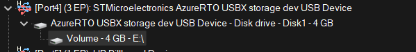
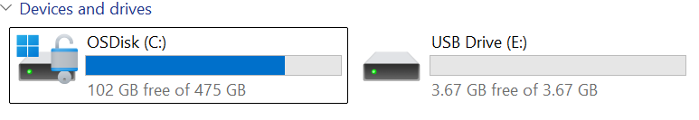
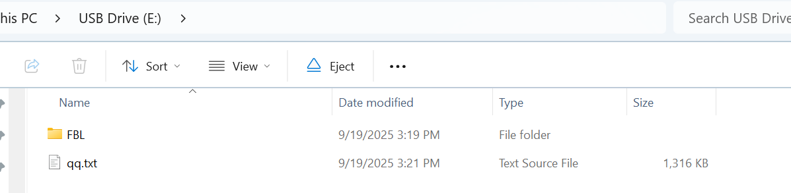

# STM32U5 USB MSC USBX standalone demo

This guide provides a comprehensive approach to build a bare-metal USB Mass Storage Class (MSC) device application on STM32U5G9J-DK1 using the Azure RTOS USBX stack. 

## Hardware & Software needed

Hardware:
- [STM32U5G9J-DK1](https://www.st.com/en/evaluation-tools/stm32u5g9j-dk1.html) development board
- eMMC interface embedded in the STM32U5G9J-DK1 board.

Software:
- EWARM v9.50.2 
- [STM32CubeMX](https://www.st.com/en/development-tools/stm32cubemx.html) V6.15.0
- [STM32CubeU5](https://github.com/STMicroelectronics/STM32CubeU5/) firmware package (includes USBX middleware)

## Materials Provided

- STM32U5 USB MSC USBX standalone example project demonstrating USB MSC device implementation without ThreadX.

## Setup

1) Connect the STM32U5G9J-DK1 board to your PC using a USB cable over CN5.  
2) Build and flash the USB MSC standalone application onto the board.  
3) The application initializes USBX by calling `MX_USBX_Device_Init()` in `main()`.  
4) The `USBX_Device_Process()` function is called continuously in the main loop to run the USBX stack.  
5) Connect CN4 type C to your PC and see the magic 

## Expected behavior

When plugged into a PC host, the STM32U5G9J-DK1 enumerates as a USB MSC device. During enumeration, the device provides all required descriptors (device descriptor, configuration descriptor, string descriptors) for host identification. Once enumeration completes successfully, a new removable drive appears on the host system. Standard read, write, and format operations can be performed as with any other removable drive.

## Troubleshooting

Caution: never use `status = UX_SUCCESS;` in `USBD_STORAGE_Read`, `USBD_STORAGE_Write`, or similar USBX MSC callbacks. Use instead: status = UX_STATE_NEXT;

> **Note:** The standalone USBX variant is enabled by MX code generated defining `#define UX_STANDALONE` in `ux_user.h`.

Two callback functions are required for the USBX mass storage class device:  
- `USBD_STORAGE_Read` used to read data from the mass storage device.  
- `USBD_STORAGE_Write` used to write data into the mass storage device.

Please check the [knowledge base article]( ) for more details.

**Caution** : Issues and the pull-requests are **not supported** to submit problems or suggestions related to the software delivered in this repository. The example is being delivered as-is, and not necessarily supported by ST.

**For any other question** related to the product, the hardware performance or characteristics, the tools, the environment, you can submit it to the **ST Community** on the STM32 MCUs related [page](https://community.st.com/s/topic/0TO0X000000BSqSWAW/stm32-mcus).